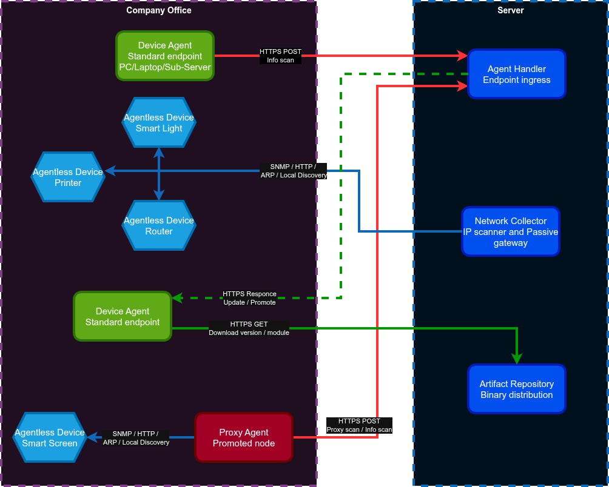
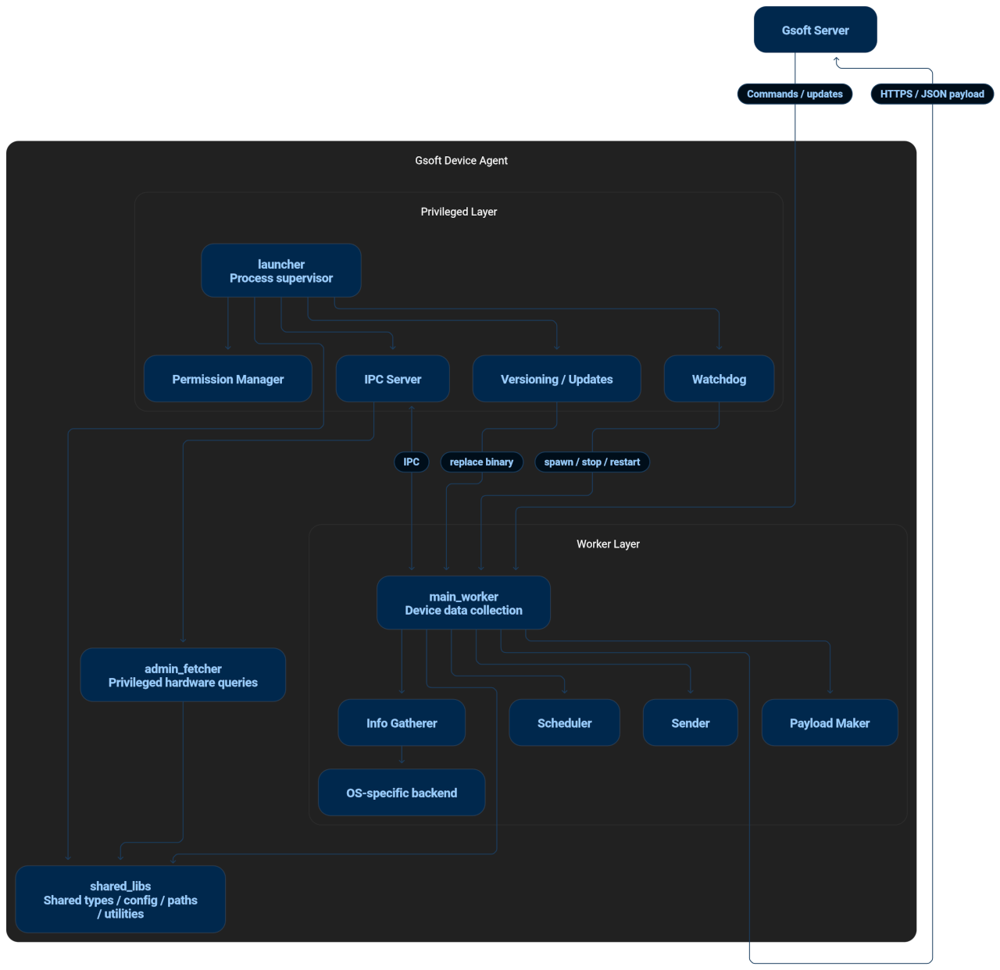
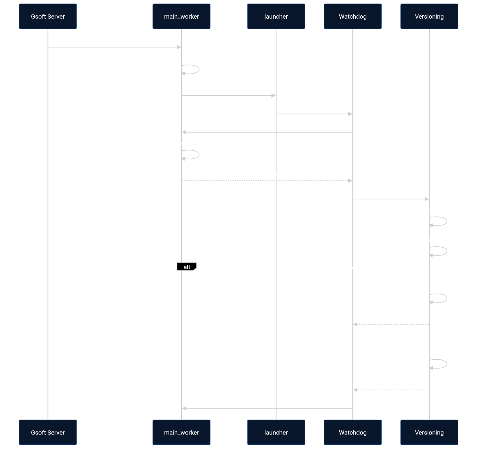
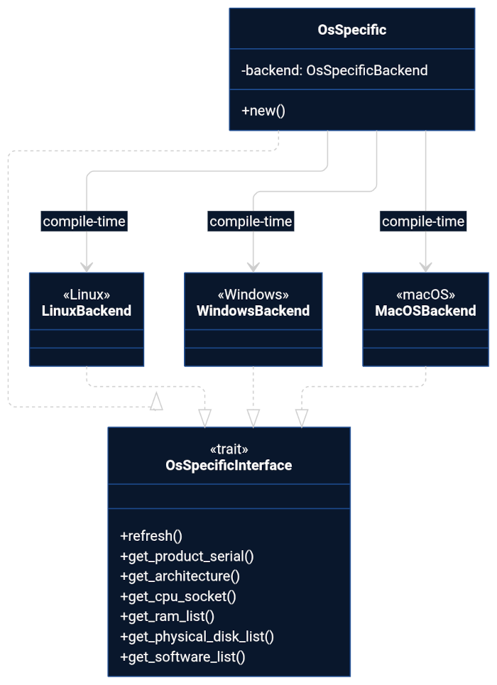

Rust Device Agent is a non-AI application that gathers device information from Endpoint machines and reports it to a Central Server for IT Asset Management (ITAM) and monitoring. Core responsibilities: gathering static (hardware) and dynamic (software/runtime) machine information, sending heartbeats, and executing commands the server sends back.

# Overview

The main goal of this Agent is to be lightweight and robust, running almost silently on Endpoint machines with a minimal CPU and memory footprint.

The Agent is designed to be **highly customizable** to customer needs. All configuration is handled through the Central Server and **cannot** be changed by the Endpoint user.

The agent is currently built for Windows and Linux (Ubuntu), with future work targeting macOS and other common Linux server distros. The codebase shares logic across operating systems, with an `os_specific` module isolating platform differences. Developers can switch targets during the build process to generate OS-specific binaries and packages.

## Binary layout

The Agent is split into separate binaries so that privilege is isolated to only where it's needed:

| Binary | Privilege | Role |
|---|---|---|
| `launcher` | Administrator / root | Lightweight, stable supervisor. Manages versioning, downloads, integrity verification, and watches over `main_worker`. Download URLs are hardcoded to the Central Server for security. |
| `main_worker` | Unprivileged | The core loop: scheduling, information gathering, networking, and handling server commands. |
| `admin_fetcher` | Administrator / root | Optional, called by `main_worker` for a one-pass "run and die" execution to read protected machine information. Read-only, **no networking capability**. |
| `proxy_scanner` | — | **Not yet implemented.** See [Planned / Not Yet Built](#planned--not-yet-built) below. |

`shared_libs` (not a runnable binary) holds types, config, and path handling shared across the three binaries above.

# Why Built This Way

The architecture makes more sense with the reasoning behind it laid out explicitly, so future work doesn't accidentally undo it:

**Privilege separation across binaries.** A single privileged binary is a single point of failure. Splitting the Agent into `launcher` (root), `main_worker` (unprivileged), and `admin_fetcher` (root, but read-only and networkless) means the part of the code that talks to the network and parses server responses — the part most exposed to attack — never itself holds elevated privilege. If `main_worker` is compromised, the attacker still has to get past `launcher`'s signature verification to touch anything as root, and `admin_fetcher` has no network stack at all to exfiltrate through.

**Secure, silent updates without going through the OS package manager.** Once installed, the Agent updates itself: `launcher` verifies an Ed25519 signature against a hardcoded public key, then does an atomic file swap (see [Use Cases §3](#3-agent-update)). This means IT doesn't need to push `.msi`/`.deb` updates for every release — only the *initial* install goes through standard OS packaging (so existing endpoint-management/group-policy tooling can mass-deploy it); every update after that is silent and self-managed.

**Mass installation and central control.** All Agent behavior — scan cadence, thresholds, which topics to collect, when to update — is driven by the Central Server, not local config a machine's user can touch. Combined with `.msi`/`.deb` initial packaging, this lets an admin roll the Agent out to an entire fleet and manage it as one system rather than machine-by-machine.

**Configurability, not a fixed policy.** Two knobs exist specifically so this fits different customer needs rather than forcing one:
- **Per-topic scheduling** — each `TaskID` (e.g. `cpu.usage`, `disk.logical.used`) has its own independent `cycle_time` and change-threshold, settable by the server. A customer can scan `cpu.usage` every 30s and `bios.version` once a day, or dial anything down to near-zero overhead.
- **Optional privileged scanning** — `admin_fetcher` is an optional binary. A deployment that doesn't need protected/admin-only fields can omit it entirely and run with `main_worker` alone, rather than being forced to grant root access it doesn't need.

## Security Model

A few deliberate constraints run through the whole design:

- **Hardcoded server endpoints.** `launcher`'s download URLs and `main_worker`'s server endpoints are compiled in, not configurable at runtime. Even a fully compromised on-disk config can't redirect the Agent to fetch binaries or send data to an attacker-controlled host.
- **Hardcoded public key, private key never on-device.** The Ed25519 public key `launcher` verifies against is baked into the binary at compile time (`shared_libs::config::SERVER_PUB_KEY`). The private key lives only on the Central Server — no endpoint ever holds anything that could be used to forge an update.
- **No raw shell command execution.** The Agent cannot execute arbitrary shell commands sent from the server. Server "commands" are a fixed, typed set (`ServerCmd::AskFullScan`, `UpdateConfig`, `UpdateAgent`, etc. — see `sender.rs`) — there's no code path that takes a string from the network and hands it to a shell.
- **Read-only, networkless privileged fetcher.** `admin_fetcher` runs with admin rights only long enough to read protected info and exit ("run and die"), and has no networking capability at all — even if it were tricked into misbehaving, it has no way to send anything anywhere.
- **Update integrity, end to end.** Before `launcher` ever touches a downloaded binary: it confirms the file isn't a symlink (stops a compromised `main_worker` from tricking root into overwriting arbitrary system files), verifies its SHA-256 hash against an Ed25519 signature, and only then performs the atomic swap with a `.bak` rollback path (full flow in [Use Cases §3](#3-agent-update)).

# System Design Diagram
- For Web view:


- For Markdown view:



# System Architecture Diagram
- For Web view:


- For Markdown view:



# Use Cases

## 1. Full Scan

The Agent is "lazy and smart" — it only gathers a *full* picture of the machine when explicitly asked, not on every cycle.

A full scan is triggered on:
- **Agent start-up** (configurable by devs via `INIT_FULL_SCAN`, generally left `true`)
- **Explicit server request** (`ServerCmd::AskFullScan` in a command response)

On every other cycle, the Agent only reports data for tasks that came due in the scheduler batch, and only if that data has actually changed:
- For numeric fields, a configurable **threshold** decides how much variance counts as a real change worth reporting.
- Drastic changes (e.g. a newly plugged-in USB, a new disk partition) always force a full report for that specific topic, even outside a full scan.
- The comparison cache is re-initialized every time the machine boots.

The heartbeat is not a separate mechanism — it rides on `general.run_time`, since that value changes on every cycle. Whatever cycle time `general.run_time` is configured with *is* the heartbeat interval.

> **Known limitation** (see `todo.md`): the cache currently reads and compares *all* topics rather than doing a targeted, per-topic refresh. A move to a true delta-cache (cache built at payload time, not scan time) is planned but not yet implemented.

## 2. Scheduling

Each unit of collectible data (`TaskID`, e.g. `cpu.usage`, `disk.logical.used`) is a task with a `cycle_time` (seconds) and a `limit`/threshold. The scheduler holds these as a **min-heap**, keyed on next execution time (`ScheduledTask::execute_at`) — "the scheduler is the config, and the config is the scheduler": the on-disk config *is* the deserialized heap state.

The cycle, in `main_worker::scheduler::Scheduler`:

1. **`go_sleep()`** — the Agent sleeps (near-0% CPU) until the earliest due task's `execute_at`, via `tokio::time::sleep_until`. If the heap is empty it falls back to a short poll interval (30s debug / 5min release).
2. **`pop_due_batch()`** — on wake, pops every task whose time has passed (handles simultaneous/overlapping tasks in one batch).
3. Gather + send the batch's data (see full-scan logic above for what actually gets reported).
4. **`reschedule_batch()`** — re-pushes each task at `now + cycle_time`. One-off tasks (`cycle_time == 0`) go to a `dead_tasks` list instead of back on the heap. If this batch came from a full scan, *every* task in the heap (not just the popped batch) is rescheduled from `now`.
5. **`update()`** — applies a server-sent config delta directly to the live heap: it recomputes each affected task's next fire time from when it last actually ran, so a shortened cycle can fire early and a lengthened one doesn't reset unfairly. Immediately persisted via `save()`.

On boot, the persisted config is deserialized straight back into the heap — a task whose stored timestamp is already in the past runs immediately (catch-up for machines that were off/asleep).

> **Open design question** (see `todo.md`): whether the min-heap is the right structure long-term vs. a timer-wheel or delta-queue is still being evaluated — a slot-based timer wheel was the original design (see `GSOFT_design.md`), and the current min-heap implementation is what's actually shipped.

## 3. Agent Update

The Central Server integration is live and confirmed working end-to-end (excluding the pieces called out below). The flow, split across the privilege boundary on purpose — `main_worker` is unprivileged and could be compromised by a malicious payload, so it never gets to write its own replacement binary:

- For Web view:


- For Markdown view:




1. **Server → `main_worker`**: the server includes an `UpdateAgent` command (binary name, target version, Ed25519 signature, base64-encoded) in its response to any Agent check-in. This is the same one-way HTTPS poll used for all server commands — see `sender.rs` for the full command set (`AskFullScan`, `UpdateConfig`, `UpdateAgent`, `LogLevel`, `AskSendLog`).
2. **`main_worker` downloads** the new binary and its signature to a temp path.
3. **IPC handoff to `launcher`** over a local socket: `UPDATE|<target_binary>|<signature_base64>`.
4. **`launcher` verifies before touching anything**:
   - Confirms the downloaded path is a real file, not a symlink (defends against a compromised worker tricking root into overwriting arbitrary system files).
   - Hashes the file (SHA-256) and verifies the Ed25519 signature against the server's public key, which is hardcoded into the `launcher` binary at compile time. The private key never leaves the Central Server.
   - On failure: delete the file, log a security warning, ignore the request — `main_worker` keeps running unaffected.
5. **On success — atomic swap**: `launcher` gracefully stops `main_worker` (drops its stdin pipe, waits up to `SHUTDOWN_TIMEOUT`, force-kills if it hangs), renames the current binary to `.bak` (rollback path), moves the new binary into place, and re-locks it down with `chown root:root` / `chmod 755` so the unprivileged worker can't write to it again.
6. `launcher`'s watchdog loop immediately respawns the new `main_worker`.

> **Known gap:** per-binary version tracking is currently stubbed (`mock_get_binary_version` in `main_worker/src/lib.rs`) — the Agent doesn't yet have a real way to ask each binary its own version at runtime.

# Agent Life Cycle

- **Start-up**
  - Loads local config directly into the scheduler.
  - Performs a full scan (see [Use Cases §1](#1-full-scan)).
  - Sends information to the server and handles any response commands.
  - Sleeps until the next scheduled task (interruptible).
- **Scheduled Cycle**
  - Wakes up.
  - Processes a batch of due tasks.
  - Gathers the information dictated by the batch.
  - Sends information to the server and handles any response.
  - Sleeps until the next scheduled task (interruptible).
- **Normal Shutdown** (SIGTERM/SIGINT, or launcher dropping the worker's stdin pipe)
  - Sends a final heartbeat/shutdown signal.
  - Saves the current scheduler state to disk as config.

# Planned / Not Yet Built

These are genuine gaps, not just style/polish items — worth knowing before building on top of this code (full list: `todo.md`).

### `proxy_scanner` — does not exist yet

The update path already has a named slot for it (`AgentPath::PROXY_SCANNER`), but there's no crate. This is the most involved planned feature, so it's laid out in full below rather than as a one-liner.

**Context: the Network Collector.** Separately from this Agent, a server-side module called the **Network Collector** is responsible for **Agentless Assets** — devices that can't run this Agent at all: printers/copiers, VoIP phones, projectors, switches/routers, Wi-Fi APs, UPS/PDU, NAS/SAN, hypervisor hosts, IP cameras, smart lighting controllers, HVAC systems. (The Network Collector isn't part of this Rust workspace — it's noted here because `proxy_scanner`'s job is to extend its reach.)

**The 4 scan methods** the Network Collector uses directly, and that `proxy_scanner` would need to implement to scan on its behalf from inside a remote subnet:

1. **SNMP** — query port 161 with the configured community string to pull manufacturer, firmware, uptime, and sensor data. The primary method; covers most enterprise network/office gear.
2. **Local Vendor APIs (REST/HTTP)** — hit a device's local HTTP endpoint directly (e.g. a smart-bridge's REST API) for structured JSON status.
3. **Network fingerprinting** — ARP scans to identify vendor from MAC address prefix, plus port scans (e.g. port 631/9100 strongly implies a printer) for devices that don't respond to SNMP or HTTP.
4. **Broadcast discovery** — passively listen for mDNS (Bonjour) / UPnP announcements that IoT devices broadcast on their own.

**Planned execution logic**: target an IP range → ping to find live hosts → try SNMP → fall back to HTTP APIs → fall back to fingerprinting/broadcast listening → report findings back to the Network Collector.

**What promotion would do**: the server asks the Agent Handler to promote an existing `Device Agent` to a `Proxy Agent` by pushing it the `proxy_scanner` binary (via the same signed-update mechanism used for regular updates). Once promoted, it runs the scan methods above against its own local subnet and forwards results to the Network Collector — something a cloud-hosted server can't do directly.

**Why it's worth building:**
- **Bypasses NAT/firewalls** — a cloud server physically cannot ARP-scan or reach `192.168.x.x` inside a remote office; a promoted Agent already sitting inside that network can.
- **Distributes scan load** — instead of one central scanner hitting thousands of devices, load spreads across many promoted Agents each scanning their own local switch.
- **Resilient to server downtime** — a promoted Agent can cache scan results locally and push them once the Central Server is back online.

**Known tradeoffs to design around before building it:**
- **IDS/IPS false positives** — a workstation suddenly port-scanning/SNMP-sweeping its subnet looks like malware; promoted IPs need to be whitelisted with the networking team ahead of time.
- **Resource impact on the host** — a "beefy" idle-looking PC might belong to someone actively using its CPU; scanning needs strict CPU/RAM caps so it doesn't interfere with the actual user.
- **The churn problem** — if the machine hosting the Proxy Agent gets shut down (e.g. end of workday), the server needs to detect the missed check-in and re-elect a different machine to take over scanning for that subnet.
- Multiple Proxy Agents can be assigned to one large subnet to split the scan range between them.

**Promotion/demotion logic itself** (turning a standard Agent into a Proxy Agent and back) is also not implemented yet — it depends on the binary above existing first.

# Build

- Remember to omit feature `local_workspace` when building for deploy.
```shell
cargo build --release --no-default-features
```

## Rust Target Configuration

This workspace contains platform-specific implementations selected at compile time
using Rust's `#[cfg(target_os = "...")]`.

When generating documentation or building the project, make sure the intended
target is selected. Otherwise, platform-specific modules that do not match the
current target (current machine OS) will not be compiled and therefore will not appear in generated
documentation.

For example, when you want to work on a Linux development environment from other OS, like Windows, the VS Code
workspace configuration should use the Linux target:

```json
{
    "rust-analyzer.cargo.target": "x86_64-unknown-linux-gnu"
}
```

## Viewing the docs (`cargo doc`)

Every public item is documented inline with rustdoc (`///`/`//!`) comments. To browse them as generated HTML:

```shell
cargo doc --no-deps --document-private-items --open
```

- `--no-deps` skips generating docs for third-party dependencies (much faster, and keeps the output focused on this codebase).
- `--document-private-items` include non-public items (such as private functions, structs, fields, and modules) in the generated documentation.
- `--open` builds and immediately opens it in your browser; drop it if you just want the files under `target/doc/`.
- To regenerate for a single crate only: `cargo doc --no-deps --document-private-items -p main_worker --open` (swap in `launcher`, `admin_fetcher`, or `shared_libs` as needed).

## `local_workspace` feature and path resolution

`shared_libs` defines a feature flag that's **on by default**:

```toml
# crates/shared_libs/Cargo.toml
[features]
default = ["local_workspace"]
local_workspace = []
```

A plain `cargo build`/`cargo run` therefore uses dev-friendly paths automatically. Only a deploy build (`--no-default-features`) switches to real OS install paths. See `shared_libs/src/path/<os>.rs` (`AgentPath`) for the three tiers:

1. **Always real OS paths, regardless of the feature** — used even in local dev: `RUN_PATH` (`/run/rust-agent`), `SOCKET_FILE` (`/run/rust-agent/ipc.sock`), `TEMP_DOWNLOADED_PATH` (`/tmp/rust-agent`). These directories must exist and be writable for local `launcher`↔`main_worker` IPC and the update-download flow to work, even before you touch the feature flag.
2. **`#[cfg(feature = "local_workspace")]`** (default): `CONFIG_FILE` = `./doc/config.json`, `LOG_PATH` = `./doc/logs`, binaries under `./target/debug|release/`. These are relative to the current working directory — always run `cargo` commands from the workspace root.
3. **`#[cfg(not(feature = "local_workspace"))]`** (deploy): `CONFIG_FILE` = `/var/lib/rust-agent/config`, `LOG_PATH` = `/var/log/gsoft_agent`, binaries under `/opt/gsoft_agent/bin/` or `/opt/rust-agent/bin/` depending on the constant.

> **Known gap:** `shared_libs/src/path/windows.rs` is currently empty — the Windows path implementation hasn't been written, unlike other Windows-specific modules (`os_specific/windows.rs`, `versioning/windows.rs`) which do have real code.

## OS Abstraction

The agent supports multiple operating systems by keeping OS-specific implementations behind a common interface.

Several modules use the same pattern:

- For Web view:


- For Markdown view:




Rust selects the appropriate implementation **at compile time** using `#[cfg(target_os = "...")]`.

For example, `main_worker/src/os_specific/mod.rs` exposes a common `OsSpecificBackend` type, while the actual implementation comes from the platform-specific module:

```rust
#[cfg(target_os = "linux")]
pub use linux::OsSpecificBackend;

#[cfg(target_os = "windows")]
pub use windows::OsSpecificBackend;
```

This means the rest of the code should normally **not need to care which OS it is running on**. It uses the common interface, and Rust chooses the correct implementation when building the project.

### Why this matters

When modifying platform-specific functionality, be careful about **which layer you are editing**:

* `mod.rs` — platform abstraction and compile-time selection
* `linux/` — Linux-specific implementation
* `windows/` — Windows-specific implementation

A change made only to one platform implementation will not automatically affect the other platforms.

Likewise, avoid putting OS-specific behavior into the common layer unless it genuinely belongs there. The purpose of this structure is to keep platform differences isolated.

### Other modules using this pattern

The same approach is used in several places in the workspace, including:

* `main_worker::os_specific`
* `main_worker::ipc`
* `launcher::ipc`
* `launcher::watchdog`
* `launcher::versioning`
* `launcher::permission`
* `shared_libs::path`

When adding or changing platform support, check both the common `mod.rs` and the corresponding platform-specific implementation.


# Getting Familiar With the Code (Walkthrough)

A self-guided path through the codebase, useful if you're picking this project up fresh:

1. **See what raw info-gathering looks like.** The root-level `examples/*.rs` files (`gather_info.rs`, `disk_info.rs`, `linux_ram.rs`, `smbios_cpu.rs`, `secure_boot.rs`, `motherboard_slot.rs`, `os_handler.rs`, `linux_network.rs`, `linux_software.rs`) are reference snippets showing raw OS-level output (sysfs, SMBIOS tables) before it's normalized into the Agent's `TaskID`/JSON model. Note: the repo root is a virtual workspace manifest (`[workspace]` only, no `[package]`), so these aren't attached to a buildable target — they're meant to be read, not run via `cargo run --example`.

2. **Understand the `//DEV` block.** In `crates/main_worker/src/lib.rs`, inside `process_cycle()`, right after the real `self.sender.transmit(...)` call, an unconditional variable shadow replaces the live server response with a hardcoded `Vec<ServerCmd>`. It's not feature-gated — as the code stands, it always overrides the real response. Useful for reading/stepping through each `ServerCmd` branch (`AskFullScan`, `UpdateConfig`, `UpdateAgent`) without a live connection.

3. **Trace the init sequence.** Read in order: `main.rs` → `DeviceAgent::new()` (builds `PayloadMaker`, `Sender`, calls `config_handler::load_config()`) → `load_config()` (deserializes `AgentPath::CONFIG_FILE` straight into a `Scheduler`; falls back to `init_config()` if missing/empty/corrupt, which seeds ~80 default `ScheduledTask`s, one per `TaskID`) → `run()`'s `tokio::select!` loop calls `process_cycle()` each iteration (pop due batch → gather → reschedule → send → handle commands → sleep).

4. **Test the signature-verification/update flow end-to-end**, using the provided mocks:
   1. Build the decoy binary: `crates/main_worker/examples/mock_new_main_worker.rs` — a fake "updated" binary that just prints `"New binary running"` in a loop.
   2. Create `/tmp/rust-agent/` if needed, and place the built binary there renamed to `main_worker` (the exact path `versioning::handle_update` expects).
   3. Run `cargo run --example keypair_mock -p launcher`. This generates a reproducible Ed25519 keypair (fixed seed), reads the dummy binary, signs it, and prints a `SERVER_PUB_KEY` byte array plus a base64 signature.
   4. Temporarily paste that `SERVER_PUB_KEY` into `crates/shared_libs/src/config.rs` in place of the real key — **local testing only, revert before committing.**
   5. Feed the printed signature into the update path — simplest way is to swap the placeholder signature in the `//DEV` `ServerCmd::UpdateAgent` block for the one `keypair_mock` printed.
   6. Watch `doc/logs/launcher/`: success looks like symlink check → hash/signature verified → `main_worker` gracefully stopped → backed up to `.bak` → new binary swapped in and locked down → respawned (now printing "New binary running").
   7. Also test the failure path: flip a character in the signature and confirm `launcher` rejects it, deletes the temp file, and leaves the running `main_worker` untouched.

# Where to Look Next

- `todo.md` — running list of known gaps and optimization ideas.
- `doc/` — sample payloads (`doc/sample/`), logs, architecture figure, and Windows-specific field mapping notes (`doc/others/`).
- Per-item rustdoc comments in the code itself for implementation-level detail — see [Viewing the docs](#viewing-the-docs-cargo-doc) above.

# IDE note

- Recommended to use VS Code Extension `Better Comments` with these settings:
```json
"better-comments.tags": [
        {
            "tag": "!",
            "color": "#FF2D00",
            "strikethrough": false,
            "underline": false,
            "backgroundColor": "transparent",
            "bold": false,
            "italic": false
        },
        {
            "tag": "?",
            "color": "#00FFA2",
            "strikethrough": false,
            "underline": false,
            "backgroundColor": "transparent",
            "bold": false,
            "italic": false
        },
        {
            "tag": ": ",
            "color": "#00FBFF",
            "strikethrough": false,
            "underline": false,
            "backgroundColor": "transparent",
            "bold": false,
            "italic": false
        },
        {
            "tag": "_",
            "color": "#FF00EE",
            "strikethrough": false,
            "underline": true,
            "backgroundColor": "transparent",
            "bold": false,
            "italic": false
        },
        {
            "tag": "todo",
            "color": "#FF8C00",
            "strikethrough": false,
            "underline": true,
            "backgroundColor": "transparent",
            "bold": false,
            "italic": false
        },
        {
            "tag": "dev",
            "color": "#00D9FF",
            "strikethrough": false,
            "underline": true,
            "backgroundColor": "transparent",
            "bold": false,
            "italic": false
        }
    ],
```